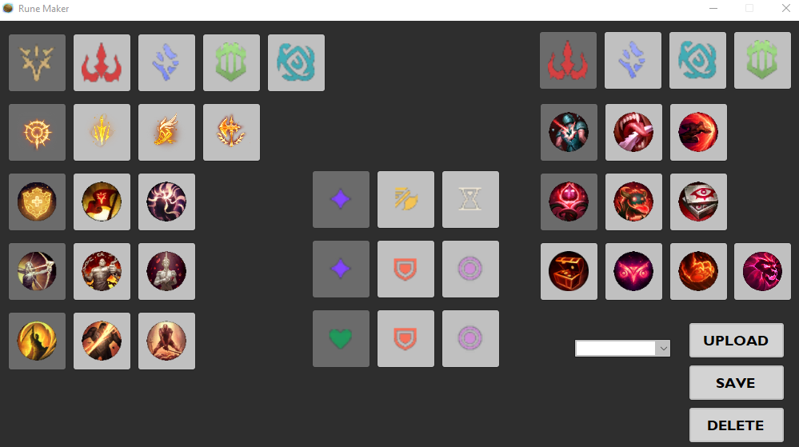
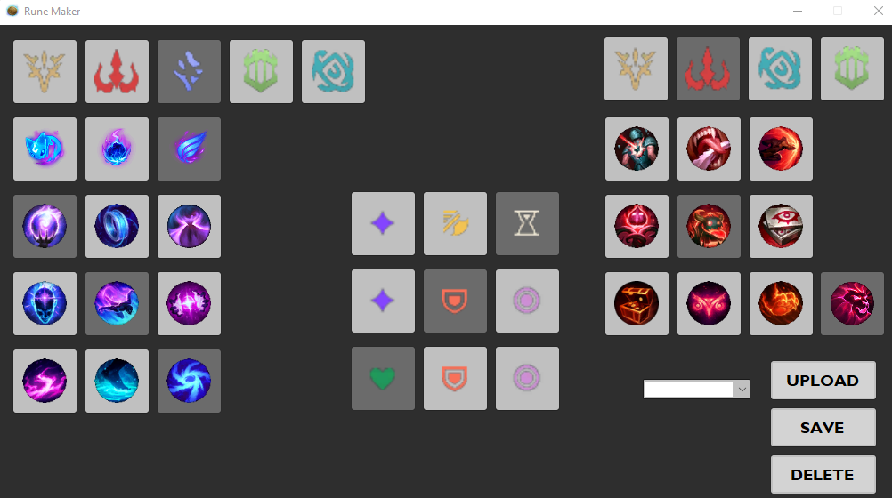
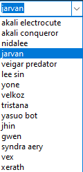
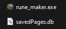

# Rune Maker

### Presentation

This is my first solo project. It is an application that allows you to create your pages of League of legend runes without limits.

### Working

First of all you have to launch your league of legend client. Then launch rune_maker.exe, the app will look for the client process and look in its launch arguments to find the game installation folder. Then the app reads the lockfile to extract the data that will be needed for requests to the APIs. This one is integrated into the client and the communication is done by http request. All images and data displayed in the window are retrieved using the API. There is an upload button that changes the current rune page used in game to the one displayed in the rune maker window. The save button saves the page displayed in the file savedPages.db thanks to sqLite, it is necessary to have written the name of the page in the combobox, the delete button, deletes the page selected in the combobox. To know that at the launch of rune maker are loaded in the combobox the name of all the registered pages. These pages are loaded by clicking on an element.

### Preview

     

### Main Files

